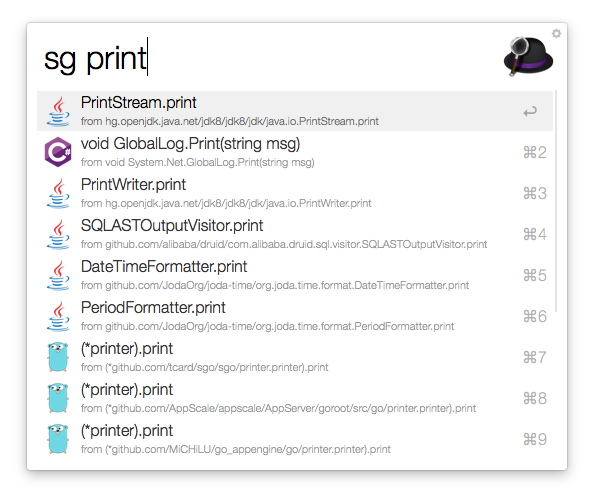
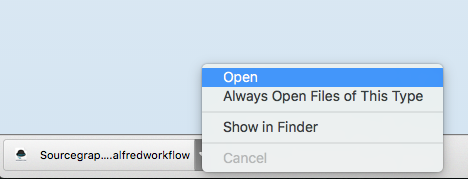

# Sourcegraph for Alfred [ [Download Workflow](https://github.com/sourcegraph/sourcegraph-alfred/releases/latest) ] 

*Sourcegraph for Alfred is in beta mode. Feedback or issue? Please email us at support@sourcegraph.com or [file an issue.](https://github.com/sourcegraph/sourcegraph-alfred/issues)*

[Sourcegraph](https://sourcegraph.com) is a global code search and cross‑references engine. Search for a function, type, or package, and see how other developers use it, across all repositories. Sourcegraph for Alfred brings you the power of Sourcegraph global code search to your Alfred application launcher.

## Overview

Sourcegraph for Alfred allows you to view Sourcegraph search results in Alfred, the macOS productivity app.

## Installation

In order to use this Workflow you must have [Alfred](https://www.alfredapp.com/) and the [Alfred Powerpack](https://www.alfredapp.com/powerpack/).

To install Sourcegraph for Alfred, [download the latest .alfredworklow.](https://github.com/sourcegraph/sourcegraph-alfred/releases/latest) and open the workflow file. 

## Usage
Launch Alfred using [your configured hotkey](https://www.alfredapp.com/help/workflows/triggers/hotkey/). Type `sg` followed by a search term relevant to the documentation you're looking for and select the most relevant item from the menu. Search items open in your default browser.

Try some common searches:
- `http.Get`
- `Sprintf`
- `func Decode`
- `gorilla/mux`
- To see what else works, try [global code search on Sourcegraph](https://sourcegraph.com/search)

## Support

Sourcegraph for Alfred is compatible with Alfred versions 2 and 3.
